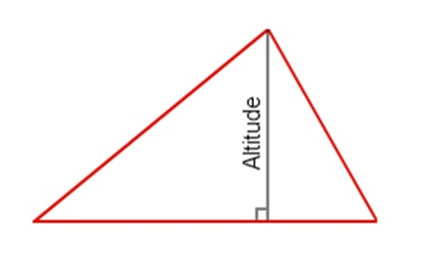
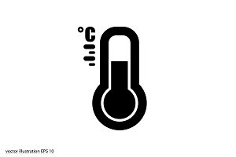
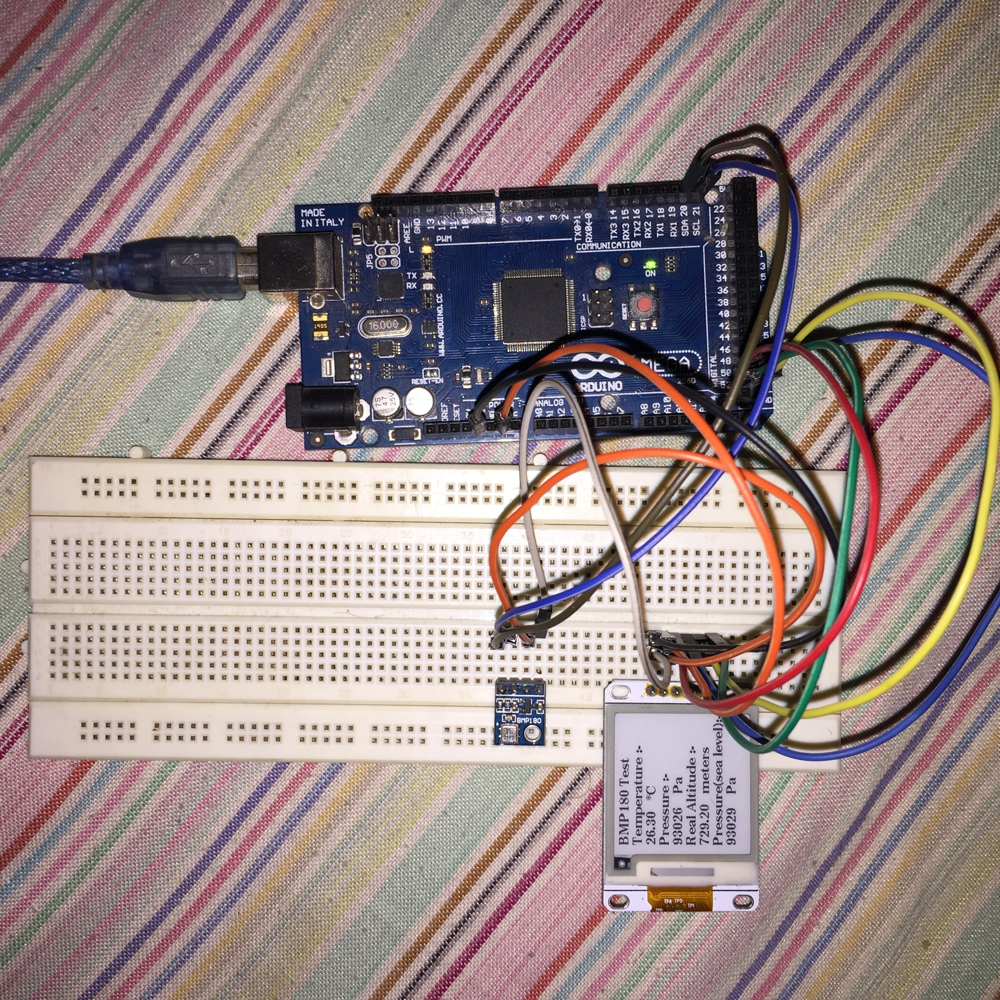
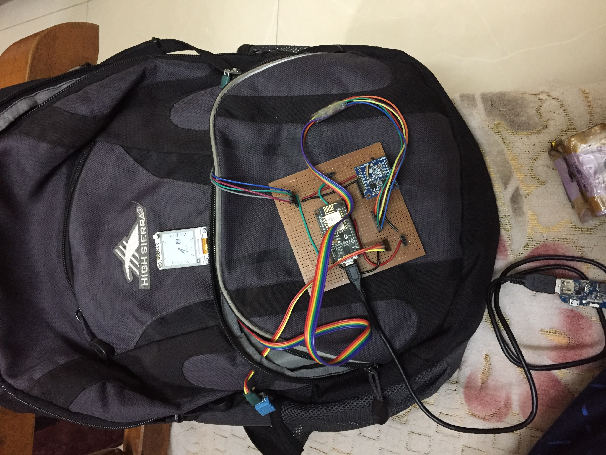

# ePaper-Watch

## File Description

1. `/test_watchos/test_watchos.ino` - The main code.
2. `hum.h`, `ht.h`, `press.h`, `thermo.h`, `watchface.h` - The header files containing the images in arrays.

---

## Images used

   
 
 

---

## Parts used

1. Esp8266
2. [e-Ink display](https://www.aliexpress.com/item/1-54inch-e-Paper-Module-200-200-E-Ink-Display-Screen-SPI-Wide-Viewing-Angle-Supports/32839190925.html) 1.54 inch (200*200 pixels) 
3. DHT11 hunidity sensor
4. BMP180 pressure sensor

---

## How to

Just plug in any arduino device make the connections. Open the `/test_watchos/test_watchos.ino` in the Arduino IDE and uploa to the selected device.

---

## Project images

### Breadboard implementation  

### Actual Implementation    

---

## Project Results

### Values

### Switch Cases

 

 

 
